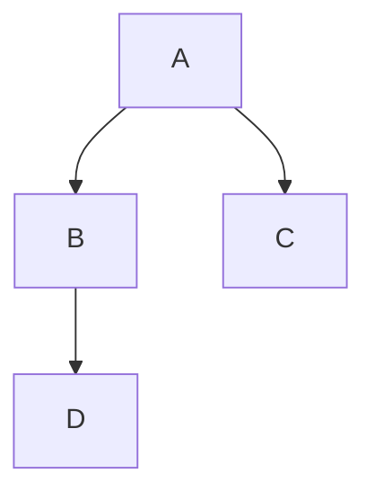

Mermaid and Markdown is widely supported match. With mermaid you can describe diagrams and get them rendered next to your Markdown text. It is kind of a markdown flavor, but not supported by all Markdown processors. Use this guide to get result as described in the title.

<!--more-->

You will need:

- [Pandoc](https://pandoc.org/installing.html)

```zsh
brew install pandoc
```

- [pdflatex](https://linux.die.net/man/1/pdflatex)

```zsh
brew cask install basictex
```

- [pandoc mermaid-filter](https://github.com/raghur/mermaid-filter)

```zsh
npm i -g mermaid-filter
```

After everything installed (assume that `pandoc` and `mermaid-filter` are
available in your `echo $PATH`)

## Example

This document itself is written in markdown. Access the source and save it as `mermaid-pandoc-guide.md` then use pandoc and the filter to create a PDF.

```zsh
pandoc mermaid-pandoc-guide.md -o mermaid-pandoc-guide.pdf --toc -V papersize:a4 --highlight-style pygments -N -V geometry:"top=2cm, bottom=1.5cm, left=2cm, right=2cm" -V toc-title:"Inhaltsverzeichnis"
```

This mermaid graph must be rendered properly:


