In 2021 I read 20 books. Some of them were good and some bad. Out of these books only two stuck with me: **Ilium** by Dan Simmons and **Flowers for Algernon** by Daniel Keyes.

**Ilium** is a must read for every fantasy and/or science fiction fan. It does not attract by a catchy story or using smart concept. The sheer unlimited creativeness gets one hooked on the book. Currently I am finishing the second book and it has been on of the largest I read in a while.

**Flowers for Algernon** is my definition of literature. Daniel writes about intelligence in a way that makes it much more understanding and compelling.

And here is the full 2021 book list:

<!--more-->

Title: Schuld\
Author: Ferdinand von Schirach\
Comment: Ferdinand abducts the readers into the gray area of law and justice with his concise and attentive writings. In this book he presents short stories about guilt.\
Rating: 7/10\
ISBN: 9788790755768\
Finished: 2021-01-05\

Title: Trotzdem\
Author: Ferdinand von Schirach; Alexander Kluge\
Comment: Ferdinand and Alexander are sharing their thoughts, but are missing a common thread.\
Rating: 4/10\
ISBN: 9783641271169\
Finished: 2021-01-05\

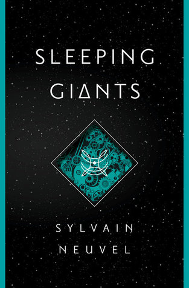

Title: Sleeping Giants\
Series: Themis Files #1\
Author: Sylvain Neuvel\
Comment: Big robots hidden on earth. The first is awaken and its technologies are beyond human understanding.\
Rating: 8/10\
ISBN: 9781101886700\
Finished: 2021-01-06\

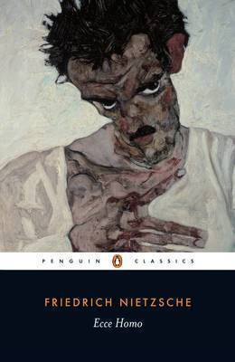

Title: Ecce Homo\
Author: Friedrich Nietzsche\
Comment: Difficult to read. I might give this another try, but first want to know more about Nietsche.\
Rating: 8/10\
ISBN: 9783734045844\
Finished: 2021-01-09\

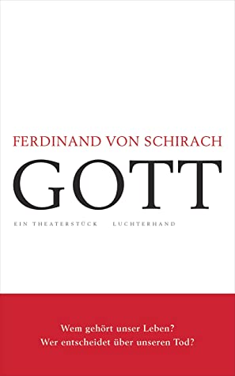

Title: GOTT\
Author: Ferdinand von Schirach\
Comment: Supplying the means for committing suicide is legal in Switerland. Through this I got insight on the debate about euthanasia.\
Rating: 7/10\
ISBN: 9783641256067\
Finished: 2021-01-10\

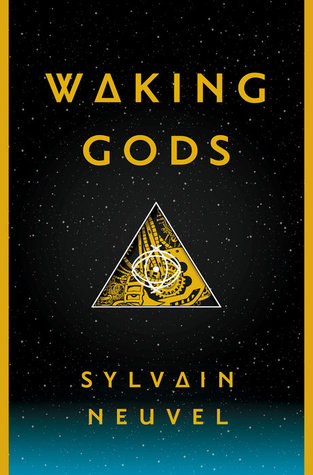

Title: Waking Gods\
Series: Themis Files #2\
Author: Sylvain Neuvel\
Comment: The initial idea was fantastic, but nothing new is added.\
Rating: 7/10\
ISBN: 9781101886731\
Finished: 2021-01-17\

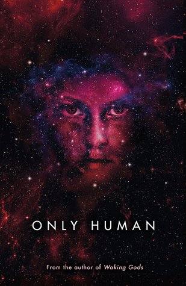

Title: Only Human\
Series: Themis Files #3\
Author: Sylvain Neuvel\
Comment: The series closes without extending the basic idea and concept of the books.\
Rating: 6/10\
ISBN: 9781405935715\
Finished: 2021-02-13\

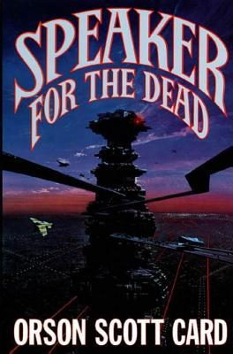

Title: Speaker for the Dead\
Series: Ender's Saga #2\
Author: Orson Scott Card\
Comment: Years ago I read the first Ender book. This book is a good start into the series.\
Rating: 7/10\
ISBN: 9781429963947\
Finished: 2021-03-03\

Title: Der Koch\
Author: Martin Suter\
Comment: A well known swiss authors wroter another book.\
Rating: 6/10\
ISBN: 9783257600469\
Finished: 2021-04-18\

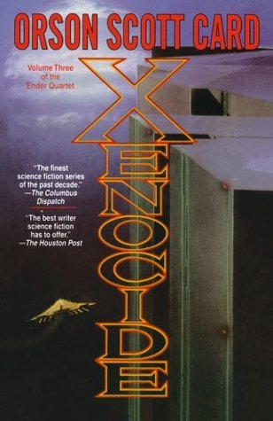

Title: Xenocide\
Series: Ender's Saga #3\
Author: Orson Scott Card\
Comment: The book has more pages, but the story is not unfolding as it should.\
Rating: 7/10\
ISBN: 9780312861872\
Finished: 2021-05-08\

Title: Jeder Mensch\
Author: Ferdinand von Schirach\
Comment: Learned about the human rights charta and how it should be updated.\
Rating: X/10\
ISBN: 9783641283742\
Finished: 2021-05-08\

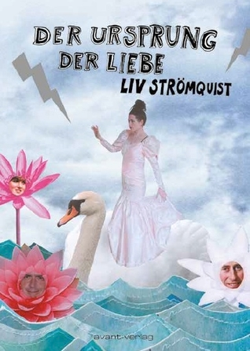

Title: Der Ursprung der Liebe\
Author: Liv Strömquist\
Comment: My first comic. Liv is presenting feminist topics in the best way possible.\
Rating: 8/10\
ISBN: 9783945034897\
Finished: 2021-06-03\

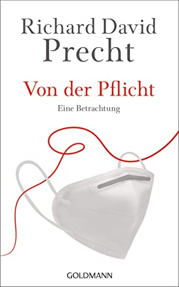

Title: Von der Pflicht\
Author: Richard David Precht\
Comment: With freedom comes duty. That's it.\
Rating: 6/10\
ISBN: 9783641281199\
Finished: 2021-06-27\

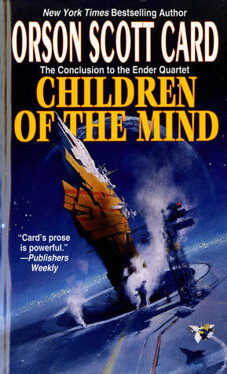

Title: Children of the Mind\
Series: Ender's Saga #4\
Author: Orson Scott Card\
Comment: More endurance is need to finish the series.\
Rating: 6/10\
ISBN: 9781429963923\
Finished: 2021-07-16\

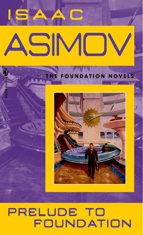

Title: Prelude to Foundation\
Series: Foundation (Publication Order) #6\
Author: Isaac Asimov\
Comment: A lover of the foundation series, this book is a great adding.\
Rating: 8/10\
ISBN: 9780553278392\
Finished: 2021-08-04\

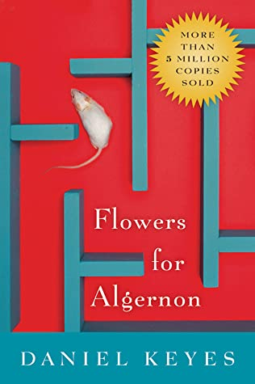

Title: Flowers for Algernon\
Author: Daniel Keyes\
Comment: A must read. This is a very creative way to teach about intelligence.\
Rating: 9/10\
ISBN: 9780547539638\
Finished: 2021-08-31\

Title: Hold Up the Sky\
Author: Cixin Liu\
Comment: Cannot remember any story.\
Rating: 5/10\
ISBN: 9781838937638\
Finished: 2021-09-26\

Title: Gedankenschlosser\
Author: Friedrich Dürrenmatt\
Comment: Another well known Swiss author.\
Rating: 7/10\
ISBN: 9783257261585\
Finished: 2021-10-06\

Title: Ilium\
Series: Ilium #1\
Author: Dan Simmons\
Comment: My book of the year. Science fiction beyond imagination.\
Rating: 10/10\
ISBN: 9780575087989\
Finished: 2021-10-30\

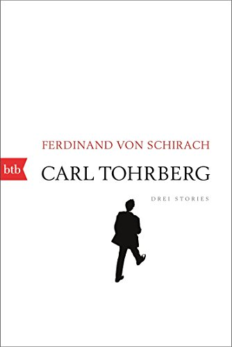

Title: Carl Tohrberg\
Author: Ferdinand von Schirach\
Comment: Three short stories by Ferdinand.\
Rating: 7/10\
ISBN: 9783641203405\
Finished: 2021-11-02\

