In 2023 I read 17 books. Most of them were great, it was difficult to choose my favorites. As most of them were science fiction books, I chose a non-fiction and a fiction book. My favorite fiction book was **The Futurological Congress** by Stanislaw Lem and the non-fiction book is **Corruptible** by Brian Klaas.

And here is the full 2022 book list:

<!--more-->

Title: Valuable Humans in Transit and Other Stories\
Author: qntm\
Comment: Fascinating sci-fi short stories.\
Rating: 8/10\
Finished: 2023-01-04

Title: Allmen und der Koi\
Author: Suter, Martin\
Comment: A classic swiss crime novel.\
Rating: 7/10\
ISBN: 9783257609912\
Finished: 2023-01-24

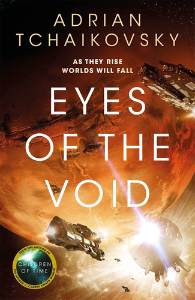

Title: Eyes of the Void\
Series: The Final Architecture #2\
Author: Tchaikovsky, Adrian\
Comment: Really like this science fiction series. It does everything very well.\
Rating: 8/10\
ISBN: 9781529051964\
Finished: 2023-03-01

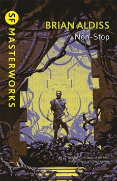

Title: Non-stop\
Author: Aldiss, Brian Wilson\
Comment: Started to read the SF Masterworks collection and was not disappointed. A very intruiging read. You will not know the twist until the very end.\
Rating: X/10\
ISBN: 9781857989984\
Finished: 2023-03-07

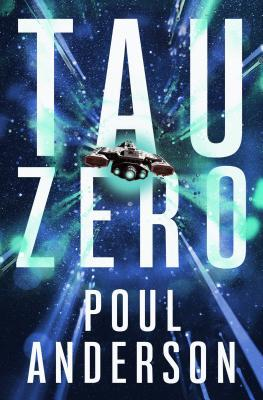

Title: Tau Zero\
Author: Anderson, Poul\
Comment: Interesting take on the time dilation and relativity.\
Rating: 7/10\
ISBN: 9781504053709\
Finished: 2023-03-21

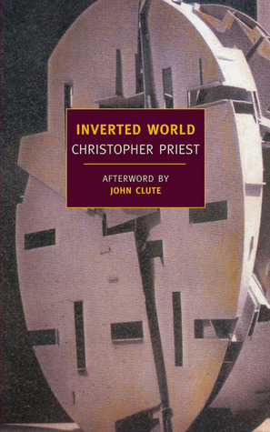

Title: Inverted World\
Author: Priest, Christopher\
Comment: The prestige is one of my favorite movies, so I wanted read a book from the author. Priest created another mysterious world over the edge of the possible.\
Rating: 8/10\
ISBN: 9781590177051\
Finished: 2023-04-10

Title: The Futurological Congress\
Author: Lem, Stanislaw\
Comment: The book is known for the fact that it cannot be made into a movie. I wanted to know why and was suprised. It is trippy read that forcefully extends your imagination.\
Rating: 10/10\
ISBN: 9783518471456\
Finished: 2023-04-26

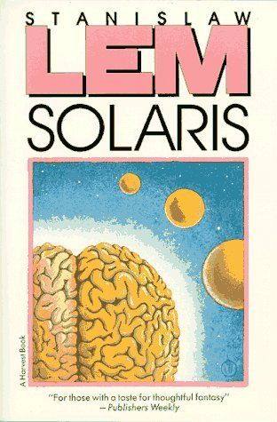

Title: Solaris\
Author: Lem, Stanisław\
Comment: As I was hooked on Stanislaws writing I went on to another classic. Even if you've seen the movie adaption, you have to read this book.\
Rating: 9/10\
ISBN: 9780156837507\
Finished: 2023-05-19

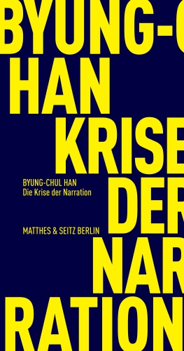

Title: Die Krise der Narration\
Author: Han, Byung-Chul\
Comment: Byung-Chul Han is my favorite philosopher. The intervines with his existing ideas, but gets confusing when it comes to the actual topic.\
Rating: 6/10\
ISBN: 9783751805643\
Finished: 2023-05-20

Title: Demokratie braucht Religion\
Author: Rosa, Hartmut\
Comment: I learned about Rosa Hartmut from philosoph talk show. I elaborated his ideas about experiencing resonance. A very interesting take on how to live fulfilling and happy life. However, this short novel seems to be out-of-bounds from his usual talks and writings.\
Rating: 6/10\
ISBN: 9783466373031\
Finished: 2023-05-21

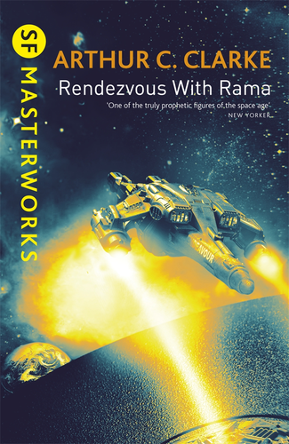

Title: Rendezvous with Rama\
Author: Clarke, Arthur C.\
Comment: This story leaves you thinking about what could be.\
Rating: 9/10\
ISBN: 9780575077331\
Finished: 2023-07-09

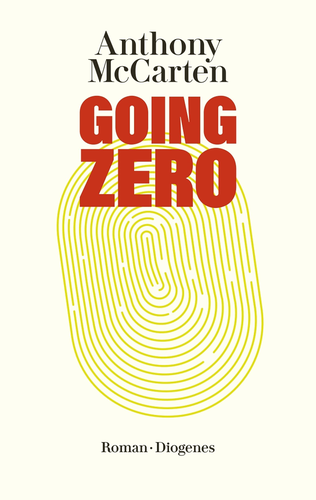
Title: Going Zero\
Author: McCarten, Anthony\
Comment: A story about surveillance capitalism in the hand of a megalomaniac and genius girl going against it. The characters are a bit dull at the beginning, but get better to the end.\
Rating: 6/10\
ISBN: 9783257613100\
Finished: 2023-07-19

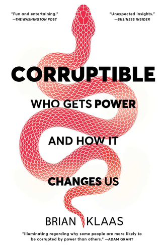

Title: Corruptible\
Author: Klaas, Brian\
Comment: I learned about Brian Klaas and his book from Youtube. Whoever is interested on how to answer populism and problems in hierarchical structures must read this book. The problems and reasoning is well written, however, the chapter on how to answers the corruption is quite short.\
Rating: 8/10\
ISBN: 9781982154103\
Finished: 2023-08-10

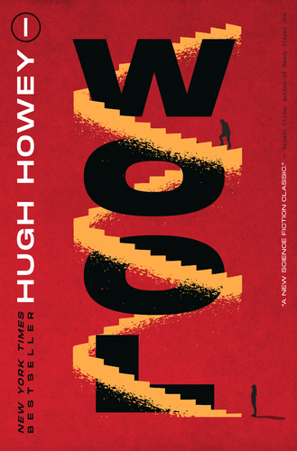

Title: Wool\
Series: Silo #1\
Author: Howey, Hugh\
Comment: It is a dystopian, well thought and mysterious story. I could not put this book down. Every page felt like a cliffhanger.\
Rating: 8/10\
ISBN: 9780358447849\
Finished: 2023-08-27

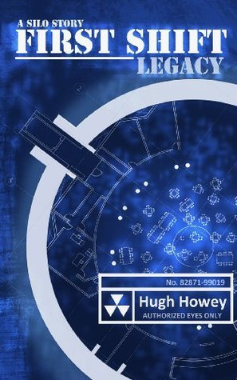

Title: First Shift: Legacy\
Series: Silo #2\
Author: Howey, Hugh\
Comment: The series continuous as good as the first book.\
Rating: 8/10\
ISBN: 9781448151639\
Finished: 2023-09-16

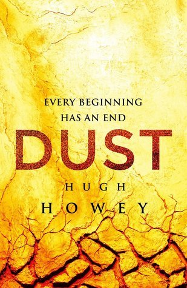

Title: Dust\
Series: Silo #3\
Author: Howey, Hugh\
Comment: The final book of the series is a nice conclusion.\
Rating: 8/10\
ISBN: 9781490904382\
Finished: 2023-10-05

Title: The Invisible Man\
Author: Wells, HG\
Comment: A classic novel. Well written for its age.\
Rating: 7/10\
ISBN: 9780451528520\
Finished: 2023-11-01
