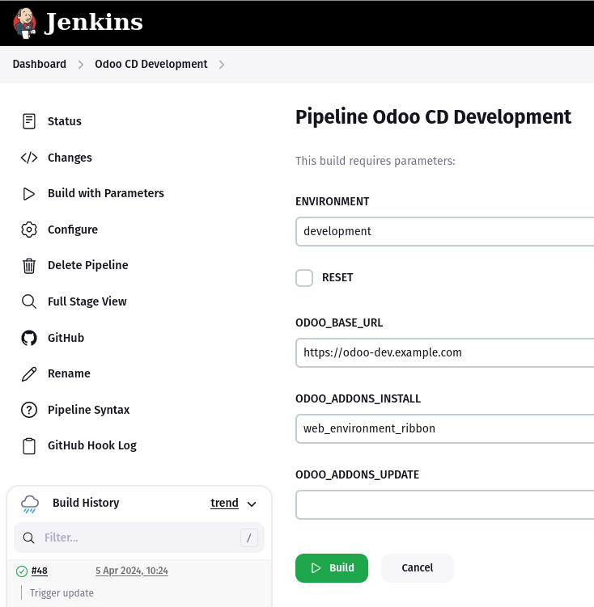

Jenkins is a popular but outdated CI/CD system. Compared to modern CI/CD systems such as GitHub Actions or GitLab Workflows, Jenkins does not deliver on containerization. As Docker containers are high in demand for building and hosting applications Jenkins has to go some extra miles. Nontheless, Jenkins is yet the only self-hostable feature-rich CI/CD solution. For a project I went with Jenkins to deploy a multi-stage Odoo envrionment.

In this post I would like to present the main parts of the final project such as the Docker setup or the Jenkins pipeline. An important goal was that the deployment can be done without Jenkins.

<!--more-->

The project files are checked into a GitHub repo. It follows the GitOps approach. The repo has three branches with differen roles:

* **main**: Productive Odoo environment
* **integration**: Copies and updates Odoo database from production
* **development**: Sets up an Odoo database with demo data

On all branches there are these files:

* **docker-comopse.yml.template**: Template for docker compose config
* **odoo.conf.template**: Odoo config with env vars
* **entrypoint.sh**: Odoo start script that templates the odoo.conf with env vars
* **Dockerfile**: Build instructions for the Docker image
* **.dockerignore**: Ignore files for Docker image build
* **.gitmodules**: Odoo modules are added as git submodules
* **task**: Bash script that contains the build and deployment instructions
* **Jenkinsfile**: Jenkins pipeline definition that wraps the task script
* **.env.template**: Template for .env file for deployment from localhost

Lets have a closer look at these files.

**docker-compose.yml.template**

```yml
version: "3"
services:
  ${SERVICE_NAME}:
    image: ${DOCKER_REGISTRY}/${DOCKER_TAG}
    restart: unless-stopped
    environment:
      HOST: ${PGHOST}
      USER: ${PGUSER}
      PASSWORD: ${PGPASSWORD}
      PGHOST: ${PGHOST}
      PGUSER: ${PGUSER}
      PGPASSWORD: ${PGPASSWORD}
      ENVIRONMENT: ${ENVIRONMENT}
      DB_NAME: ${DB_NAME}
      LOG_LEVEL: ${LOG_LEVEL}
      ODOO_BASE_URL: ${ODOO_BASE_URL}
    volumes:
      - /usr/share/${SERVICE_NAME}/addons:/mnt/extra-addons
      - ${SERVICE_NAME}:/var/lib/odoo
    networks:
      - ${DOCKER_NETWORK}
networks:
  ${DOCKER_NETWORK}:
    external: true
volumes:
  ${SERVICE_NAME}:
    name: ${SERVICE_NAME}
```

This docker compose file is templated in the deployment step. As you can see the service name is variable. The service name translates to the git branch.

**odoo.conf.template**

```ini
[options]
addons_path = /mnt/extra-addons
data_dir = /var/lib/odoo
admin_passwd = $pbkdf2-sha512$25000$ZWlQaGFlbmVlMWVlamV1Tmc0S2k$4562zeZ1EPUwULaA6PtxViA.zM3TYAu0du2EPxciiZcFLMpjBJ5HeyNuXrEuSDh9.5EpZueQfy7ZGMfCiP6kYA
limit_request = 8192
limit_time_cpu = 3600
limit_time_real = 3600
max_cron_threads = 1
db_name = $DB_NAME
proxy_mode = True
workers = 8
log_level = $LOG_LEVEL

[ir.config_parameter]
web.base.url = $ODOO_BASE_URL
```

By default the Odoo conf does not support env vars. With the new entrypoint script we can pass env vars into the Odoo conf.

**entrypoint.sh**

```bash
#!/bin/bash

set -e

if [ -v PASSWORD_FILE ]; then
    PASSWORD="$(< $PASSWORD_FILE)"
fi

# set the postgres database host, port, user and password according to the environment
# and pass them as arguments to the odoo process if not present in the config file
: ${HOST:=${DB_PORT_5432_TCP_ADDR:='db'}}
: ${PORT:=${DB_PORT_5432_TCP_PORT:=5432}}
: ${USER:=${DB_ENV_POSTGRES_USER:=${POSTGRES_USER:='odoo'}}}
: ${PASSWORD:=${DB_ENV_POSTGRES_PASSWORD:=${POSTGRES_PASSWORD:='odoo'}}}

ME=$(basename "$0")

entrypoint_log() {
    if [ -z "${ODOO_ENTRYPOINT_QUIET_LOGS:-}" ]; then
        echo "$@"
    fi
}

auto_envsubst() {
    local TEMPLATE_FILE="${ODOO_ENVSUBST_TEMPLATE_FILE:-/etc/odoo/odoo.conf.template}"
    local OUTPUT_FILE="${ODOO_ENVSUBST_OUTPUT_FILE:-/etc/odoo/odoo.conf}"
    local FILTER="${ODOO_ENVSUBST_FILTER:-}"

    DEFINED_ENVS=$(printf '${%s} ' $(awk "END { for (name in ENVIRON) { print ( name ~ /${FILTER}/ ) ? name : \"\" } }" < /dev/null ))

    if [[ -f "$TEMPLATE_FILE" ]]; then 
        entrypoint_log "$ME: Running envsubst on $TEMPLATE_FILE to $OUTPUT_FILE"
        envsubst "$DEFINED_ENVS" < "$TEMPLATE_FILE" > "$OUTPUT_FILE"
    fi
}

auto_envsubst

DB_ARGS=()
function check_config() {
    param="$1"
    value="$2"
    if grep -q -E "^\s*\b${param}\b\s*=" "$ODOO_RC" ; then
        value=$(grep -E "^\s*\b${param}\b\s*=" "$ODOO_RC" |cut -d " " -f3|sed 's/["\n\r]//g')
    fi;
    DB_ARGS+=("--${param}")
    DB_ARGS+=("${value}")
}
check_config "db_host" "$HOST"
check_config "db_port" "$PORT"
check_config "db_user" "$USER"
check_config "db_password" "$PASSWORD"

case "$1" in
    -- | odoo)
        shift
        if [[ "$1" == "scaffold" ]] ; then
            exec odoo "$@"
        else
            wait-for-psql.py ${DB_ARGS[@]} --timeout=30
            exec odoo "$@" "${DB_ARGS[@]}"
        fi
        ;;
    -*)
        wait-for-psql.py ${DB_ARGS[@]} --timeout=30
        exec odoo "$@" "${DB_ARGS[@]}"
        ;;
    *)
        exec "$@"
esac

exit 1
```

This is a copy of the Odoo entrypoint script, but with an `auto_envsubst` function and call (copied from the Nginx entrypoint script). This function populates the odoo.conf with env vars.

**Dockerfile**

```bash
ARG ODOO_IMAGE

FROM $ODOO_IMAGE

USER root

RUN apt-get update && \
apt-get install -y --no-install-recommends \
gettext

USER odoo

COPY ./build/odoo.conf.template /etc/odoo/

COPY ./build/entrypoint.sh /

RUN pip3 install prometheus-client
```

The new entrypoint script and the Odoo conf template is copied during the build step.

**.dockerignore**

```bash
**
!extra-addons
!odoo.conf.template
!entrypoint.sh
```

Only these files are in the build context.

**task**

This is the juicy part. The following script is a command line tool to execute the build and deployment steps.

```bash
#!/bin/bash
set -e

if [[ -a ".env" ]]; then
    export $(cat .env | sed 's/^#.*//g' | xargs)
fi

: "${GIT_HASH=$(git rev-parse --short HEAD)}"
: "${BRANCH:=${GIT_BRANCH##origin/}}"
: "${BRANCH:=$(git symbolic-ref --short -q HEAD)}"
: "${BUILD_ID:=$GIT_HASH}"
: "${DOCKER_TAG:=odoo:16.0}"
: "${SERVICE_NAME:=odoo-$BRANCH}"
: "${DOCKER_NETWORK:=example.com}"
: "${DEPLOY_USERNAME:=$USERNAME}"
: "${VOLUME_NAME:=$SERVICE_NAME}"
: "${ARTIFACT:=odoo-cd-$GIT_HASH}"
: "${ARTIFACT:=odoo-cd-$GIT_HASH}"
: "${LOG_LEVEL:=warn}"
[[ "integration,development" =~ $ENVIRONMENT ]] && { LOG_LEVEL=debug; }

function help() {
    echo
    echo "task <command> [options]"
    echo
    echo "commands:"
    echo
    cat << EOF
| command   | option  | description                     |
| --------- | ------- | ------------------------------- |
| all       |         | Run all tasks.                  |
| version   |         | Show version of required tools. |
| submodule |         | Checkout all git submodules.    |
| prepare   |         | Find and copy all Odoo modules. |
| build     |         | Build Docker image.             |
| publish   |         | Publish Docker image.           |
| deploy    |         | Deploy Docker image.            |
| init      |         | Init database on container.     |
| cleanup   |         | Cleanup workspace.              |
EOF
    echo
}

start_timer() {
    START_TIME=$(date +%s)
}

end_timer() {
    END_TIME=$(date +%s)
}

log_elapsed_time() {
    local elapsed_time=$((END_TIME - START_TIME))
    echo "Elapsed time for $1: $elapsed_time seconds"
}

function info() {
    echo "Environment: $ENVIRONMENT"
    echo "Log Level: $LOG_LEVEL"
    echo "Service: $SERVICE_NAME"
    echo "Base Image: $ODOO_IMAGE"
    echo "Docker Tag: $DOCKER_TAG"
    echo "Git Branch: $BRANCH"
}

function version() {
    docker -v
    docker-compose -v
    envsubst -V
    rsync -V
}

function submodule() {
    echo "Update git submodule remote urls"
    git submodule set-url hr-attendance git@github.com:example/hr-attendance.git
    echo "Checkout git submodules"
    git submodule update --init
    echo "Remove deprecated git submodules"
    rm -rf "odoo-apps-server-tools"
    rm -rf "odoo-apps-partner-contact"
    rm -rf "odoo-apps-survey"
}

function prepare() {
    start_timer
    echo "Copy modules to extra-addons folder"
    rm -rf ./extra-addons
    mkdir extra-addons
    MODULES=$(find . -type f -name "__manifest__.py" -not -path "./extra-addons/*" | xargs dirname | sort -u)
    echo $MODULES | xargs cp -r -t extra-addons/
    end_timer && log_elapsed_time "prepare"
}

function build() {
    echo "Run Docker build $BUILD_ID with arg $ODOO_IMAGE"
    docker build . --build-arg ODOO_IMAGE="$ODOO_IMAGE" -t "$DOCKER_REGISTRY"/"$DOCKER_TAG"
}

function publish() {
    ssh_exec="ssh $DEPLOY_USERNAME@$DEPLOY_TARGET"

    echo "Publish Docker image to $DOCKER_USERNAME/$DOCKER_TAG"
    echo "$DOCKER_PASSWORD" | docker login -u "$DOCKER_USERNAME" --password-stdin
    docker push "$DOCKER_REGISTRY"/"$DOCKER_TAG"
}

function deploy() {
    start_timer
    ssh_exec="ssh $DEPLOY_USERNAME@$DEPLOY_TARGET"

    echo "Sync addons folder"
    $ssh_exec mkdir -p "/usr/share/$SERVICE_NAME/addons"
    rsync --recursive --update --delete "./extra-addons/" "$DEPLOY_USERNAME@$DEPLOY_TARGET:/usr/share/$SERVICE_NAME/addons/"

    echo "Deploy image $DOCKER_REGISTRY/$DOCKER_TAG to $DEPLOY_TARGET"
    $ssh_exec docker pull "$DOCKER_REGISTRY"/"$DOCKER_TAG"
    
    OLD_CONTAINER_ID=$($ssh_exec docker ps -f "name=$SERVICE_NAME" -q | tail -n1)
    NGINX_CONTAINER=$($ssh_exec docker ps --format '{{.Names}}' -f "name=nginx")

    export DOCKER_NETWORK
    export DOCKER_TAG
    export SERVICE_NAME
    export LOG_LEVEL
    export COMPOSE_PROJECT_NAME=odoo-cd
    export DB_NAME="$SERVICE_NAME"
    envsubst < "docker-compose.yml.template" > "docker-compose.yml"
    echo "Scale service $SERVICE_NAME to 2"
    docker-compose -H "ssh://$DEPLOY_USERNAME@$DEPLOY_TARGET" up -d --no-deps --scale "$SERVICE_NAME=2" --no-recreate "$SERVICE_NAME"
    
    NEW_CONTAINER_ID=$($ssh_exec docker ps -f "name=$SERVICE_NAME" -q | head -n1)
    NEW_CONTAINER_IP=$($ssh_exec docker inspect -f '{{range.NetworkSettings.Networks}}{{.IPAddress}}{{end}}' "$NEW_CONTAINER_ID")
    $ssh_exec curl --silent --include --retry-connrefused --retry 30 --retry-delay 1 --fail "http://$NEW_CONTAINER_IP:8069/web/login" || exit 1

    $ssh_exec docker-nginx-reload -c "$NGINX_CONTAINER"

    echo "Remove container $OLD_CONTAINER_ID"
    $ssh_exec docker stop "$OLD_CONTAINER_ID" || true
    $ssh_exec docker rm "$OLD_CONTAINER_ID" || true
    echo "Scale service $SERVICE_NAME to 1"
    docker-compose -H "ssh://$DEPLOY_USERNAME@$DEPLOY_TARGET" up -d --no-deps --scale "$SERVICE_NAME=1" --no-recreate "$SERVICE_NAME"

    $ssh_exec docker-nginx-reload -c "$NGINX_CONTAINER"
    end_timer && log_elapsed_time "deploy"
}

function init() {
    ssh_exec="ssh $DEPLOY_USERNAME@$DEPLOY_TARGET"

    if [[ $ENVIRONMENT = "integration" && $RESET = true ]]; then
        echo "Duplicate Odoo database and filestore for $SERVICE_NAME"
        $ssh_exec docker-odoo-duplicate -c "$SERVICE_NAME" -s odoo-main -t "$SERVICE_NAME" -u -r -i
        $ssh_exec docker-volume-copy -s odoo-main:/filestore/odoo-main -t "${SERVICE_NAME}:/filestore/${SERVICE_NAME}" -f
    fi

    if [[ $ENVIRONMENT = "development" && $RESET = true ]]; then
        echo "Initialize database Odoo for $SERVICE_NAME"
        $ssh_exec docker-odoo-drop -c "$SERVICE_NAME" -d "$SERVICE_NAME"
    fi

    if [[ "integration,development" =~ $ENVIRONMENT && -n "$ODOO_ADDONS_INSTALL" ]]; then
        echo "Install Odoo modules for $SERVICE_NAME"
        $ssh_exec docker-odoo-install -c "$SERVICE_NAME" -d "$SERVICE_NAME" -i "$ODOO_ADDONS_INSTALL"
    fi

    if [[ "integration,development" =~ $ENVIRONMENT && -n "$ODOO_ADDONS_UPDATE" ]]; then
        echo "Update Odoo modules for $SERVICE_NAME"
        $ssh_exec docker-odoo-update -c "$SERVICE_NAME" -d "$SERVICE_NAME" -u "$ODOO_ADDONS_UPDATE"
    fi

    if [[ "integration,development" =~ $ENVIRONMENT && -n "$ODOO_ADDONS_UNINSTALL" ]]; then
        echo "Uninstall Odoo modules for $SERVICE_NAME"
        $ssh_exec docker-odoo-uninstall -c "$SERVICE_NAME" -d "$SERVICE_NAME" -u "$ODOO_ADDONS_UNINSTALL"
    fi

    if [[ $ENVIRONMENT = "integration" && $ANONYMIZE = true ]]; then
        echo "Anonymize Odoo database $SERVICE_NAME"
        $ssh_exec bash <<EOF
docker-odoo-shell -c "$SERVICE_NAME" -d "$SERVICE_NAME" -f -p "env['hr.payslip'].search([]).cancel_sheet()"
docker-odoo-shell -c "$SERVICE_NAME" -d "$SERVICE_NAME" -f -p "env['hr.payslip'].search([]).unlink()"
docker-odoo-shell -c "$SERVICE_NAME" -d "$SERVICE_NAME" -f -p "env['hr.payroll.register'].search([]).unlink()"
docker-odoo-shell -c "$SERVICE_NAME" -d "$SERVICE_NAME" -f -p "env['account.move.line.salary'].search([]).unlink()"
docker-odoo-shell -c "$SERVICE_NAME" -d "$SERVICE_NAME" -f -p "env['ir.model.fields.anonymize'].search([]).action_anonymize_records()"
EOF
    fi

    if [[ "integration,development" =~ $ENVIRONMENT ]]; then
        echo "Restart Odoo container $SERVICE_NAME"
        ODOO_CONTAINER=$($ssh_exec docker ps -f "name=$SERVICE_NAME" -q | head -n1)
        NGINX_CONTAINER=$($ssh_exec docker ps --format '{{.Names}}' -f "name=nginx")
        $ssh_exec docker restart "$ODOO_CONTAINER"
        $ssh_exec docker-nginx-reload -c "$NGINX_CONTAINER"
    fi
}

function cleanup() {
    echo "Prune Docker images"
    docker image prune -af --filter "until=$((7*24))h"
}

case "$1" in
    help)
        help
        ;;
    all)
        version
        submodule
        prepare
        build
        publish
        deploy
        init
        ;;
    info)
        info
        ;;
    version)
        version
        ;;
    submodule)
        submodule
        ;;
    prepare)
        prepare
        ;;
    build)
        build
        ;;
    publish)
        publish
        ;;
    deploy)
        deploy
        ;;
    init)
        init
        ;;
    cleanup)
        cleanup
        ;;
    *)
        help
        exit 1;
esac
```

The most important step is the deploy function. This step deploys the container with zero downtime. It does so by starting the container so the old and new container are running at the same time (scale=2). Then it shuts down the old container and ensures only one and only the new container is running (scale=1). Once the new container is started the proxy config is reloaded to ensure the service name resolves with the new container ip address.

In the init step the Odoo database is duplicated, defused and update. On the deployment target it is expected that the [Ansible Build scripts](https://ansible.build/scripts.html) are installed.

**Jenkinsfile**

The Jenkins pipeline executes the task script. Every stage is a task step. The credentials are stored in Jenkins.

```groovy
pipeline {

    agent any

    environment {
        ODOO_IMAGE = 'odoo@sha256:7f6185af13681be1acafe491510e48584ac51a2bbda0cd322196b02ba4da6bf9'
        
        DOCKER_REGISTRY = 'example'
        DOCKER_USERNAME = 'example'
        DOCKER_PASSWORD = credentials('docker-password')
        
        DEPLOY_TARGET = 'server.example.com'
        DEPLOY_USERNAME = 'eample-git-bot'
        PGHOST = 'postgres01'
        PGUSER = 'odoo'
        PGPASSWORD = credentials('odoo-pgpassword')
    }
    
    stages {
        stage('version') {
            steps {
                script {
                    currentBuild.description = sh (script: 'git log -1 --pretty=%B', returnStdout: true).trim()
                }
                sh './task version'
            }
        }
        stage('submodule') {
            steps {
                sshagent(credentials: ['example-git-bot']) {
                    sh '''#!/bin/bash
                    [ -d ~/.ssh ] || mkdir ~/.ssh && chmod 0700 ~/.ssh
                    ssh-keyscan -t rsa,dsa github.com >> ~/.ssh/known_hosts
                    ./task submodule
                    '''
                }
            }
        }
        stage('prepare') {
            steps {
                sh './task prepare'
            }
        }
        stage('build') {
            steps {
                sh './task build'
            }
        }
        stage('publish') {
            steps {
                sshagent(credentials: ['example-git-bot']) {
                    sh '''#!/bin/bash
                    [ -d ~/.ssh ] || mkdir ~/.ssh && chmod 0700 ~/.ssh
                    ssh-keyscan -t rsa,dsa $DOCKER_TARGET >> ~/.ssh/known_hosts
                    ./task publish
                    '''
                }
            }
        }
        stage('deploy') {
            steps {
                sshagent(credentials: ['example-git-bot']) {
                    sh '''#!/bin/bash
                    [ -d ~/.ssh ] || mkdir ~/.ssh && chmod 0700 ~/.ssh
                    ssh-keyscan -t rsa,dsa $DOCKER_TARGET >> ~/.ssh/known_hosts
                    ./task deploy
                    '''
                }
            }
        }
        stage('init') {
            steps {
                sshagent(credentials: ['example-git-bot']) {
                    sh '''#!/bin/bash
                    [ -d ~/.ssh ] || mkdir ~/.ssh && chmod 0700 ~/.ssh
                    ssh-keyscan -t rsa,dsa github.com >> ~/.ssh/known_hosts
                    ./task init
                    '''
                }
            }
        }
        stage('cleanup') {
            steps {
                sh './task cleanup'
            }
        }
    }
}
```

Noteworthy is the ssh agent instruction. It loads the ssh key from the Jenkins credentials store and is then used to make the ssh connection.

A selection of environment variables is set statically and other are passed as build parameters:



**.env.template**

```bash
ENVIRONMENT=development
RESET=false
ANONYMIZE=false
BRANCH=dev
ODOO_BASE_URL=https://odoo-dev.example.com

ODOO_IMAGE=odoo@sha256:9b0eae5f92d511274b0f770bb01e09af24dec4a8316300e01a74411ecf5a6ffd

DOCKER_REGISTRY=example.com
DOCKER_USERNAME=example.com
DOCKER_PASSWORD=

DEPLOY_TARGET=server.example.com
PGHOST=postgres01
PGUSER=odoo
PGPASSWORD=
ODOO_ADDONS_INSTALL=web_environment_ribbon
ODOO_ADDONS_UPDATE=base
ODOO_ADDONS_UNINSTALL=
```

As mentioned the build and deployment works on the locally by executing the task scrip. Credentials are loaded from the .env file.

**Final thoughts**

The setup is elaborate and the and requires and understanding of Jenkins and the Odoo Docker image. I wanted to give some insights on how this often complex setups can look like.

With the Jenkins file wrapping the task file I can switch the CI/CD system with ease. Simply set up the env vars and call the task script steps in a domain specific language.