*In* 2024 I read 4 books and 10 mangas. Even though I read more mangas than books, the list will still be called "book list". And there is another update. The rating is now on a scale of 5 point instead of 10.

My favorite book was **Landkkrank** by Nikolaj Schultz. And my favorite manga was **Ion Mud** by Amaury Bündgen.

Here is the full 2024 book list:

<!--more-->
# Books

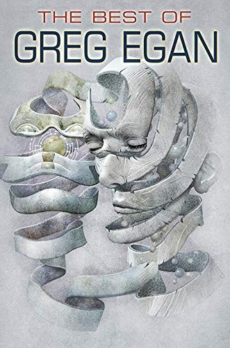

Title: The Best of Greg Egan
Author: Greg Egan\
Comment: A collection of scifi short stories and one novel.\
Rating: 3/5\
ISBN: 9781596069428\
Finished: 2024-12-14

Title: Kaptialismus und Todestrieb
Author: Byung-Chul Han\
Comment: A strong argument for the cancerous growth of capitalism.\
Rating: 4/10\
ISBN: 9783957578303\
Finished: 2024-09-24

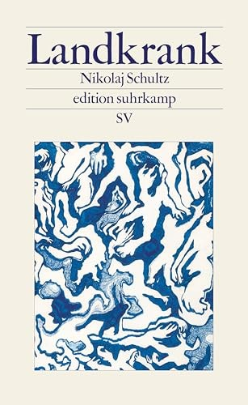

Title: Landkrank\
Author: Nikolaj Schultz\
Comment: The author frees himself from the rigidity of the climate crisis and offers hope for challenging times..\
Rating: 5/5\
ISBN: 9783518029886\
Finished: 2024-08-02

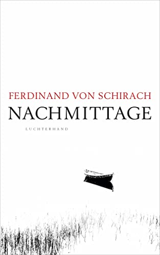

Title: Nachmittage\
Author: Ferdinand von Schirach\
Comment: Another well done book by Ferdinand.\
Rating: 4/5\
ISBN: 9783630877235\
Finished: 2024

Title: Beschleunigen wir die Resonanz!\
Author: Hartmut Rosa\
Comment: An update and an interview on the idea of resonance.\
Rating: 4/5\
ISBN: 9783518473566\
Finished: 2024-09-01

# Mangas

Some of these mangas are still ongoing, often they take years until being completion.

Title: One Piece\
Author: Oda Eiichiro\
Comment: Started reading this ongoing masterpiece from chapter 1.\
Rating: 5/5\
Chapter: 1134+
Finished: Not yet.

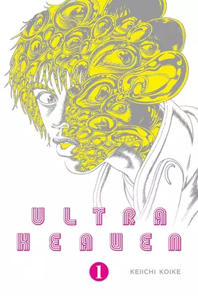

Title: Ultra Heaven\
Author: Keiichi Koike\
Comment: Overwhelming and unique drawings of paranoia and hallucinations.\
Rating: 5/5\
Chapter: 3
Finished: 2024

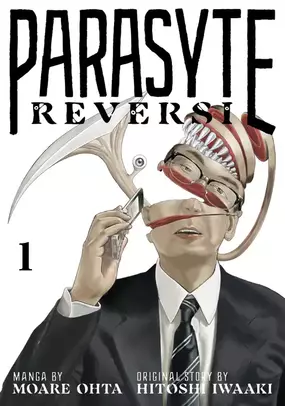

Title: Parasyte Reversi\
Author: Moare Ohta\
Comment: The followup of the parasyte manga.\
Rating: 4/5\
Chapter: 76+\
Finished: Not yet.

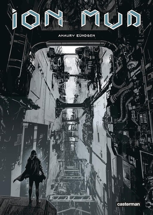

Title: Ion Mud\
Author: Amaury Bündgen\
Comment: Inspired by the manga Blame!.\
Rating: 5/5\
Volume: 1\
Finished: 2024

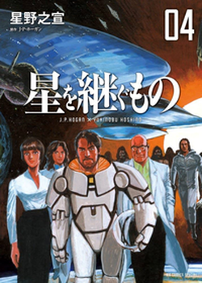

Title: Inherit the Stars\
Author: Hoshino Yukinobun\
Comment: Author does not continue the managa, but still worth the read.\
Rating: 3/5\
Chapter: 30\
Finished: 2024

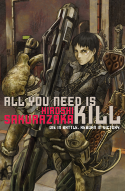

Title: All You Need Is Kill\
Author: Hiroshi Sakurazak\
Comment: The managa has been turned into the movie "Edge of Tomorrow".\
Rating: 4/5\
Chapter: 17\
Finished: 2024

Title: Alive: The Final Evolution\
Author: Tadashi Kawashima\
Comment: Cannot remember the details. Some kids with special abilities are imprisoned and escape.\
Rating: 2/5\
Chapter: 82\
Finished: 2024

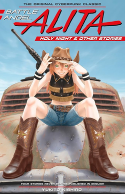

Title: Battle Angel Alita - Holy Night and Other Stories\
Author: Yukito Kishiro\
Comment: I read Battle Angel Alita in the past.\
Rating: 3/5\
Finished: 2024

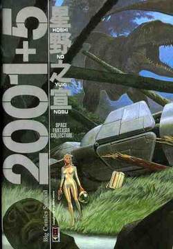

Title: 2001 + 5\
Author: Yukinobu Hoshino\
Comment: A collection of Hoshino Yukinobu's space fantasies.\
Rating: 3/5\
Chapter: 11\
Finished: 2024

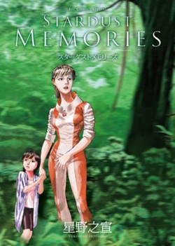

Title: Stardust Memories\
Author: Yukinobu Hoshino\
Comment: Talks about the problems and implications of space traveling.\
Rating: 4/5\
Chapter: 14\
Finished: 2024

